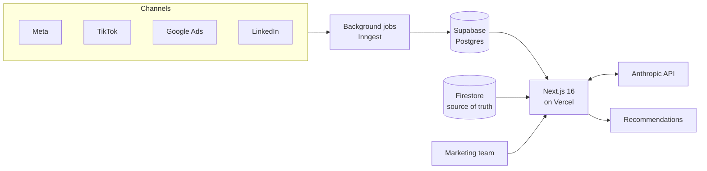

# Apollo

Elvy's internal marketing platform. I built it and still develop it. The code is private, so this is a write-up of what it does and how it's put together.

## Background

Our marketing runs across Meta, TikTok, Google, LinkedIn, print, DOOH, partners and door-to-door. For a long time the numbers were all over the place. They're now consolidated in Firestore, our single source of truth, and Apollo is where the marketing team works with them: ad data from each platform alongside the company's real numbers.

## What it does

- Pulls Meta, TikTok, Google and LinkedIn into one view
- Won't rank channels against each other on metrics they measure differently
- Gives recommendations that the team marks as implemented, skipped or watching
- Reads Elvy's own numbers, like signed customers, from Firestore
- Drafts longer texts like press releases and debate articles in Elvy's voice
- Multi-brand login with required 2FA

## How it's put together



The interface is designed as a ship's computer: a bridge, five rooms for different kinds of work, a log of decisions and clearance levels for access.

## How I work on it

I use Claude Code with a separate loop for each kind of work, run as slash commands:

```
docs/loops/
├── CORE.md
├── SHIP.md
├── BRAIN.md
├── DATA.md
├── BET.md
└── ADOPTION.md
```

Changes go to a `preflight` branch with its own environment first. I review there and merge to `main` myself.

## Some choices along the way

Channels aren't ranked against each other on conversions. Meta, TikTok, Google and LinkedIn count conversions and attribution differently, so a side-by-side ranking would be misleading.

Every recommendation needs a verdict. Otherwise suggestions pile up and nobody remembers which ones we acted on.

No manually entered numbers. Everything comes straight from Firestore, so Apollo shows the same figures as the rest of the business.

There's WebGL in a few places. A tool people use a lot is allowed to look good, as long as it doesn't slow down anyone's laptop.

Stack: Next.js 16, Supabase (EU), Inngest, Anthropic SDK, Vercel.
