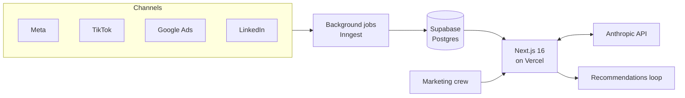

# 🛰️ Apollo

**Elvy's internal AI marketing platform, built by its CMO.**
Source is private. This is how it works and why it's built the way it is.

## Why it exists

Elvy's marketing runs across Meta, TikTok, Google and LinkedIn, plus print, DOOH, partnerships and door-to-door. The data lived in four ad platforms and a CRM, and nobody had one place to see what was working or act on it. Rather than buy a dashboard, I built the tool the team actually works in.

## What it does

| Area | What it does |
|---|---|
| Channels | Pulls Meta, TikTok, Google and LinkedIn into one view |
| Guardrail | Refuses to rank channels on metrics they don't measure the same way |
| Recommendations | AI suggestions the crew marks **Implemented**, **Skipped** or **Watching**, so there's a record of what advice was acted on |
| Ground truth | Progress follows Elvy's real signed-customer count from the source system. Manual snapshots were retired |
| Long-form | Drafts press releases and op-eds (debattartiklar) in Elvy's voice |
| Access | Multi-brand auth, enforced 2FA (TOTP), OAuth consent |

## Architecture



## The ship's computer

Apollo is designed as a ship's computer instead of a dashboard. There's a **bridge**, five **rooms** for different kinds of work, a **presence** that is the AI itself, a **log** of every decision, **decks**, and **clearance** levels for access.

## How it's built

I build Apollo with Claude Code, using separate agent loops for different kinds of work rather than one general prompt:

```
docs/loops/
├── CORE.md       # shared rules every loop inherits
├── SHIP.md       # /apollo-ship
├── BRAIN.md      # /apollo-brain
├── DATA.md       # /apollo-data
├── BET.md        # /apollo-bet
└── ADOPTION.md   # /apollo-adoption
```

Every change lands in `preflight` first, a permanent pre-launch environment on its own branch. I review it there and promote to `main` myself. The team never sees untested work.

## Decisions and tradeoffs

**Why a comparability guardrail.** Each ad platform defines conversions and attribution differently. A tool that happily ranks TikTok against Google on "cost per conversion" produces confident wrong answers, so Apollo blocks those comparisons instead of charting them.

**Why a verdict on every recommendation.** AI advice that disappears into a feed can't be held to account. Forcing a verdict turns recommendations into a record of what was acted on and what was skipped.

**Why no manual numbers.** Manually entered progress figures drift and get argued about. Pulling the signed-customer count from the source system means the tool and the business report the same number.

**Why motion.** An internal tool people are asked to live in has to feel worth opening. WebGL is allowed where it makes Apollo feel alive, as long as the device isn't overloaded.

## Stack

Next.js 16 · Supabase (Postgres, EU) · Inngest · Anthropic SDK · Vercel · Claude Code
